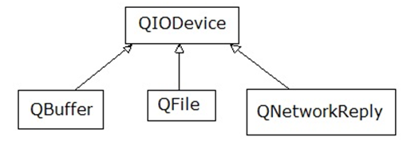

Clase 09 - 8 de abril de 2026
=============================

Registro en video de algunos temas de la clase de hoy
^^^^^^^^^^^^^^^^^^^^^^^^^^^^^^^^^^^^^^^^^^^^^^^^^^^^^

`Función genérica 2021 <https://www.youtube.com/watch?v=PkmAW31KuV0>`_ 

`Introducción al módulo network de Qt 2025 <https://www.youtube.com/watch?v=QS43ULD80fU>`_

`Primer aplicación con network 2025 <https://youtu.be/yQKcYThLkmo>`_

`webservice network QIODevice QUrl 2021 <https://youtu.be/gX-DEWwXvh4>`_

`QNetworkAccessManager imagen de internet 2021 <https://youtu.be/JtENM7t2zxE>`_

Función Genérica
================

- Supongamos que debemos implementar una función que imprima en la salida los valores de un array de enteros:

.. code-block:: cpp

	void imprimir ( int v[], int cantidad )  {
	    for ( int i = 0 ; i < cantidad ; i++ )
	        std::cout << v[ i ] << " ";
	    std::cout << std::endl;
	}

	int main( int, char ** )  {
	    int v1[ 5 ] = { 5, 2, 4, 1, 6 };
	    imprimir( v1, 3 );

	    return 0;
	}

- Ahora necesitamos la impresión de un array de float

.. code-block:: cpp

	void imprimir( float v[], int cantidad );

- Vemos que las versiones se diferencian por el tipo de datos del array. Entonces podemos utilizar lo siguiente:

.. code-block:: cpp

	template < class T > void imprimir ( T v[], int cantidad )  {
	    for ( int i=0 ; i < cantidad ; i++ )
	        std::cout << v[ i ] << " ";
	    std::cout << std::endl;
	}

	int main( int, char ** )  {
	    int v1[ 5 ] = { 5, 2, 4, 1, 6 };
	    float v2[ 4 ] = { 2.3, 5.1, 0, 2 };

	    imprimir( v1, 5 );  // qué pasa si pongo cantidad 10 -> Publica basura
	    imprimir( v2, 2 );

	    return 0;
	}

- El compilador utiliza el código de la función genérica como plantilla para crear automáticamente dos funciones sustituyendo T por el tipo de dato concreto.

.. code-block:: cpp

	Con T = int     utiliza -->     void imprimir( int v[], int cantidad )

	Con T = float   utiliza -->     void imprimir( float v[], int cantidad )

- Aquí, la única operación que realizamos sobre los valores de tipo T es:

.. code-block:: cpp

	std::cout << v[ i ]

- Esto pone una restricción, ya que sólo se admitirá los tipos de datos para los que se puedan imprimir en pantalla con:

.. code-block:: cpp

	std::cout <<

Web Service
^^^^^^^^^^^

- Para intercambiar datos entre aplicaciones
- Generalmente a través del protocolo HTTP
- La info puede viajar en XML, JSON, etc.
- Fomenta y facilita el uso y desarrollo de APIs Web
- https://es.wikipedia.org/wiki/Servicio_web

**Algunas APIs disponibles**

- Instagram - https://developers.facebook.com/products/instagram/apis/
- MercadoLibre - http://developers.mercadolibre.com
- Twitter - https://dev.twitter.com
- Facebook - https://developers.facebook.com
- Amazon - https://developer.amazonservices.es
- Spotify - https://developer.spotify.com/web-api
- Google - https://developers.google.com
	- Youtube
	- Traductor
	- Google+
	- Maps
	- Street View

QUrl
^^^^

- Para manipular una url ingresada por el usuario 

.. code-block::
	
	// URL ejemplo: http://www.yahoo.com.ar/documento/info.html
		
	// El método path() devuelve /documento/info.html
	// El método host() devuelve www.yahoo.com.ar
	
	QUrl url( "http://www.yahoo.com.ar/documento/info.html" );
	qDebug() << url.host();
	qDebug() << url.path();

QByteArray
^^^^^^^^^^

- Se podría decir que es administrador de un char*
- Se puede usar el operador []
- Almacena \\000 al final de cada objeto QByteArray

Clase QNetworkAccessManager
^^^^^^^^^^^^^^^^^^^^^^^^^^^

- Permite enviar y recibir solicitudes a la red
- Se obtiene un objeto ``QNetworkReply`` con toda la información recibida

.. code-block::

	QNetworkAccessManager * manager = new QNetworkAccessManager;

	connect( manager, SIGNAL( finished( QNetworkReply * ) ), this, SLOT( slot_respuesta( QNetworkReply * ) ) );

	manager->get( QNetworkRequest( QUrl( http://mi.ubp.edu.ar" ) ) );

- Para poder utilizar las clases de network hay que agregar en el .pro

.. code-block::

	QT += network  // Esto agrega al proyecto el módulo network

- Por defecto, el módulo 'gui' y el módulo 'core' están incluidos.
- Para utilizar HTTPS, Qt utiliza OpenSSL https://www.openssl.org/source
	- Se puede descargar desde https://slproweb.com/products/Win32OpenSSL.html
	- Por ejemplo, para 64 bits elegir `Win64 OpenSSL v1.1.1w <https://slproweb.com/download/Win64OpenSSL-1_1_1w.exe>`_

Clase QIODevice
^^^^^^^^^^^^^^^

- Clase base de los dispositivos de I/O
- Algunos métodos:

.. code-block::

	QByteArray readAll()  		   // Lee todos los datos disponibles.
	QByteArray read( qint64 max )  // Lee hasta max datos disponibles.
	QByteArray readLine()  		   // Lee una linea.

		
Clase QNetworkReply
^^^^^^^^^^^^^^^^^^^

- Contiene los datos y encabezado de una respuesta
- Una vez leídos los datos, ya no quedarán disponibles.
- Para controlar los bytes que se van descargando usar la señal:

.. code-block::

	void downloadProgress( qint64 bytesRecibidos, qint64 bytesTotal )

Clase QNetworkRequest
^^^^^^^^^^^^^^^^^^^^^

- Contiene la información que se envían en la petición
- Seteamos algún campo de la cabecera con:

.. code-block::

	void setRawHeader( const QByteArray &nombre, const QByteArray & valor )

	QNetworkRequest request;
	request.setUrl( QUrl( ui->le->text() ) );
	request.setRawHeader( "User-Agent", "MiNavegador 1.0" );

Clase QNetworkProxyFactory
^^^^^^^^^^^^^^^^^^^^^^^^^^

- Permite configurar un servidor proxy a nuestra aplicación Qt.
- Lo siguiente utiliza la configuración del sistema (Chrome y Edge, no Firefox, ¿Opera?, ¿Brave?).

.. code-block::

	#include <QApplication>
	#include "principal.h"
	#include <QNetworkProxyFactory>

	int main( int argc, char ** argv )  {
	    QApplication a( argc, argv );

	    QNetworkProxyFactory::setUseSystemConfiguration( true );

	    Principal w;
	    w.showMaximized();

	    return a.exec();
	}

Algunas particularidades de QNetworkReply y QNetworkRequest
^^^^^^^^^^^^^^^^^^^^^^^^^^^^^^^^^^^^^^^^^^^^^^^^^^^^^^^^^^^

- Para controlar los bytes que se van descargando se puede usar la señal de ``QNetworkReply``:

.. code-block:: c

	void downloadProgress( qint64 bytesRecibidos, qint64 bytesTotal )

- Los campos de la cabecera HTTP se pueden setear con el método de ``QNetworkRequest``:

.. code-block:: c

	void setRawHeader( const QByteArray & nombre, const QByteArray & valor )

	QNetworkRequest request;
	request.setUrl( QUrl( this->le->text() ) );
	request.setRawHeader( "User-Agent", "MiNavegador 1.0" );

Obtener una imagen desde internet
^^^^^^^^^^^^^^^^^^^^^^^^^^^^^^^^^

.. code-block::

	void Principal::slot_descargaFinalizada( QNetworkReply * reply )  {
	    QImage image = QImage::fromData( reply->readAll() );
	}

Ejercicio 04 - Tablero Kanban colaborativo (Qt + API)
^^^^^^^^^^^^^^^^^^^^^^^^^^^^^^^^^^^^^^^^^^^^^^^^^^^^^

Desarrollar una aplicacion de escritorio en Qt que permita gestionar tareas
tipo Kanban, usando el backend FastAPI del VPS y persistencia en MySQL.

- Consolidar CRUD, orden y movimiento entre columnas.
- Incorporar actualizacion colaborativa.

Requisitos
----------

- Backend (FastAPI):

  - CRUD de columnas y tarjetas.
  - Endpoint para mover tarjeta entre columnas.
  - Endpoint para reordenar tarjetas en una columna.
  - Autenticacion basica (reutilizar la del VPS).

- Base de datos (MySQL):

  - Tablas: ``columns``, ``cards``, ``card_order``.

- App Qt:

  - Vista Kanban con columnas y tarjetas.
  - Crear/editar/eliminar tarjetas y columnas.
  - Mover tarjetas (drag-and-drop o botones "mover").
  - Actualizacion en tiempo real (polling cada 3-5s o WebSocket).

- Persistencia:

  - Al reiniciar, el tablero queda igual.

